# APAC 1. Un formulari de Login

## Sobre el codigo de las actividades

### Indica como accedes a los diferentes elementos de la interficie

- MainActivity.kt

	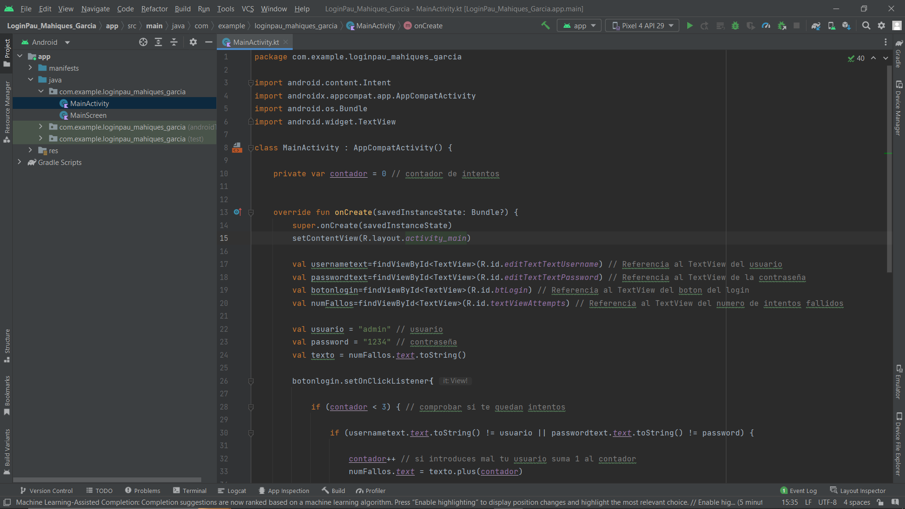

- MainScreen.kt
  
	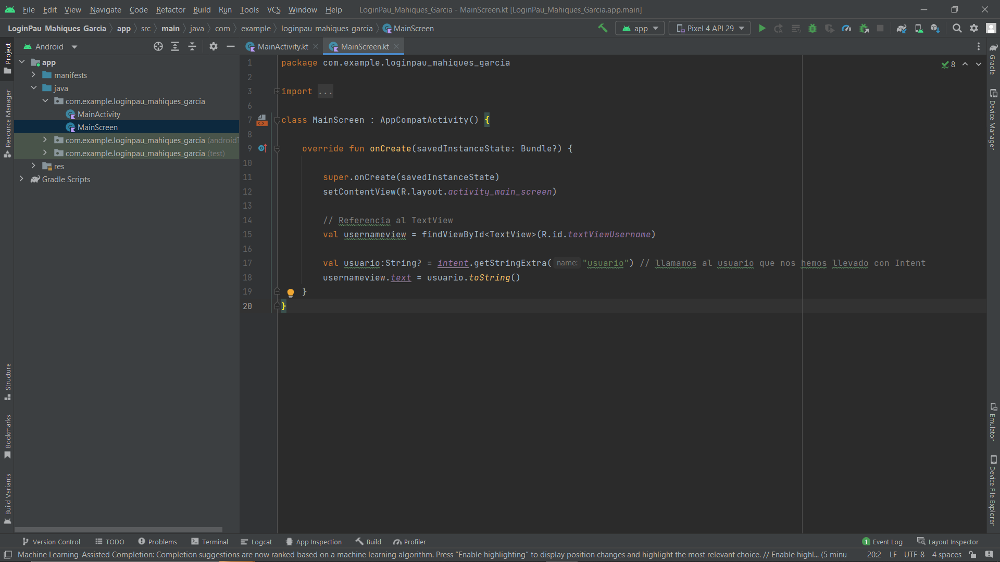

- activity_main_screen.xml

	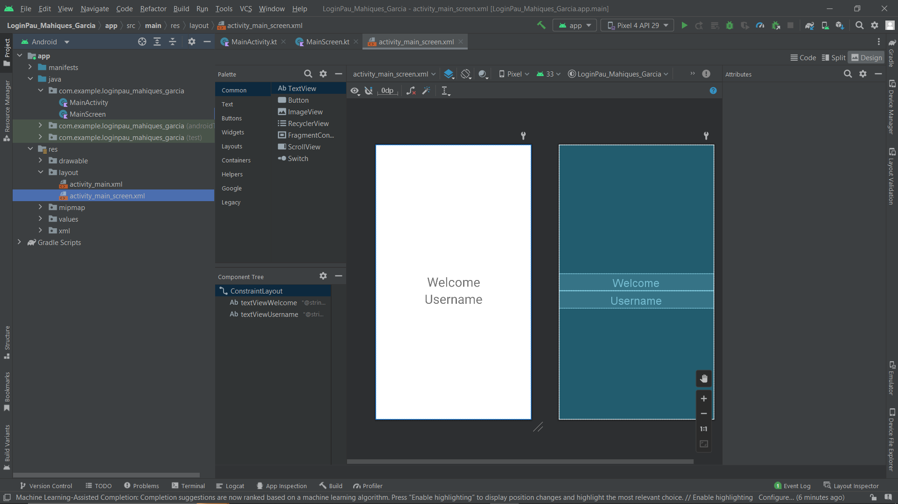

- activity_main.xml

	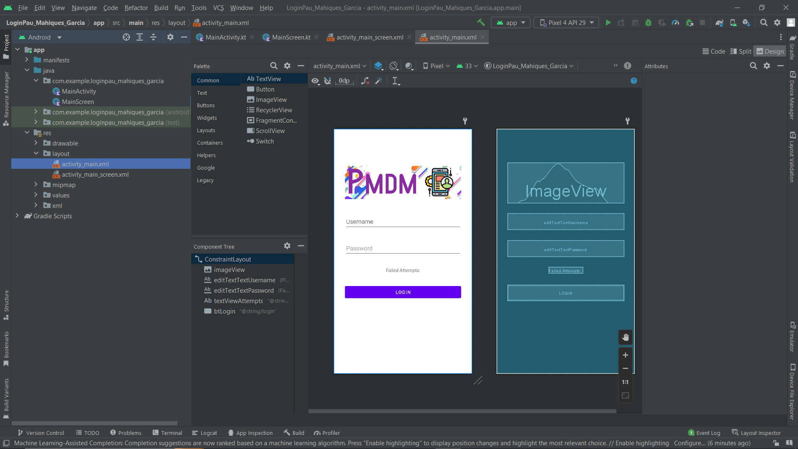

- strings.xml

	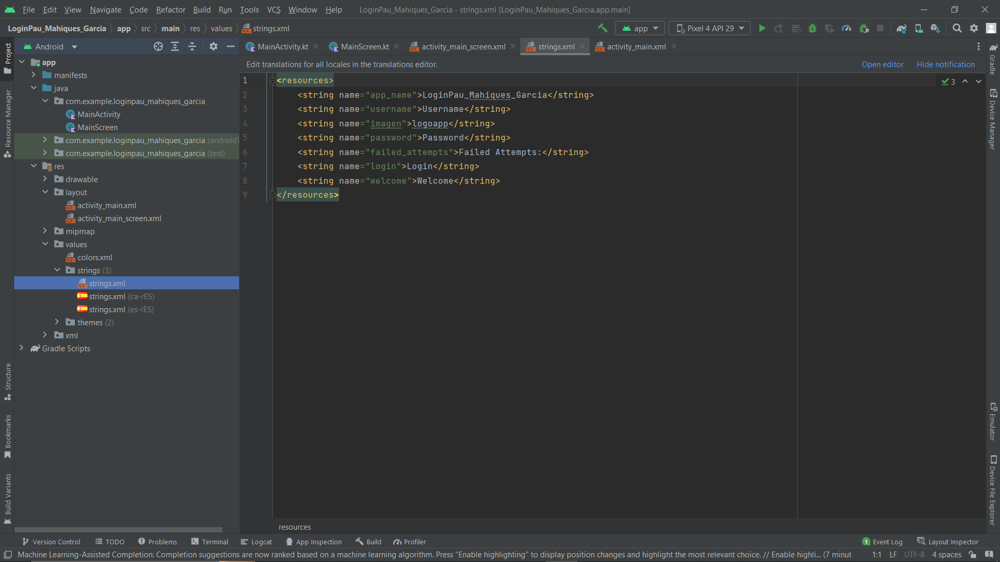

- strings.xml (traducción catalan)

	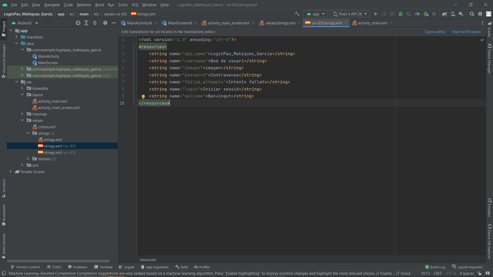

- strings.xml (traducción castellano)

	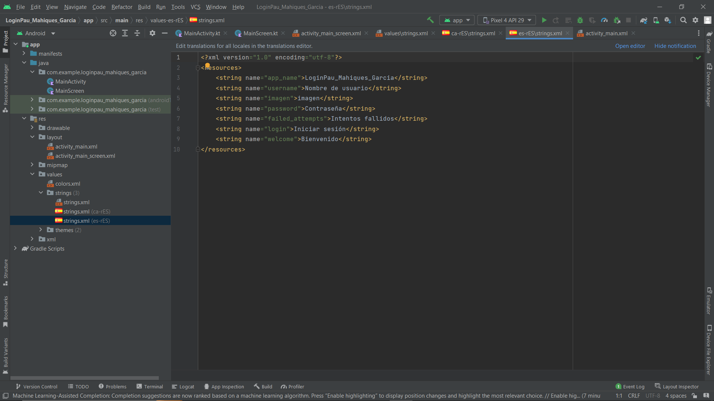

- AndroidManifest.xml

	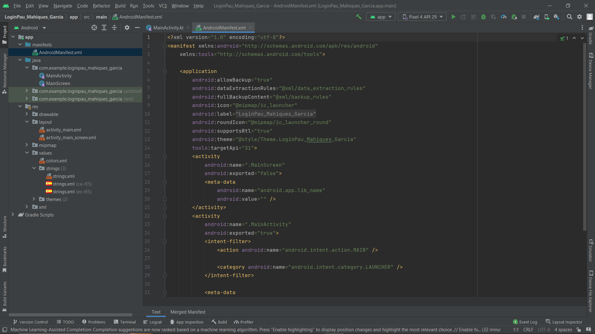

###  Indica como has realizado la navegación entre una activitad y otra

- Con la función Intent

	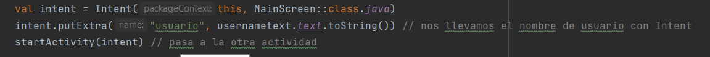

## Sobre el archivo Manifest, investiga lo siguiente:

### Cuantas actividades aparecen configuradas? Muestralas y indica las principales diferencias entre ellas y que significan

- Aparecen dos actividades configuradas:

	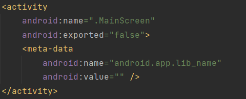 

	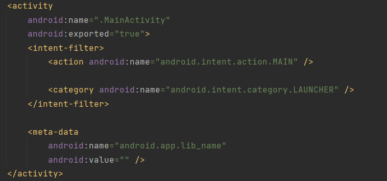

- En MainScreen android:exported tiene un valor "**false**" mientras que en MainActivity es "**true**", este ocasiona que si es "**true**", cualquier app puede acceder a la actividad y se puede iniciar con su nombre de clase exacto, mientra que si es "**false**", la actividad solo se puede iniciar con componentes de la misma aplicación, aplicaciones con el mismo ID de usuario o componentes del sistema con privilegios.

- En MainActivity tenemos un **<intent-filter>**, Cuando creamos una nueva actividad, servicio o receptor broadcast, podemos informar al sistema del tipo de intenciones implícitas que se pueden resolver con nuestro componente. Para ello utilizaremos un filtro de intenciones mediante la etiqueta **<intent-filter>**

## Sobre las traducciones realizadas

### Examina la carpeta de los recursos de tipo String, tanto en la vista de Android como en la vista de los archivos del proyecto. Hay nuevos archivos, carpetas o recursos? Que nombre tienen y que contienen cada uno?

-  Despues de traducir el archivo strings.xml con el editor se han creado dos carpetas value, values-ca-rES para el catalan y values-es-rES para el castellano, cada uno conteniendo un archivo strings.xml traducido a su respectivo idioma

	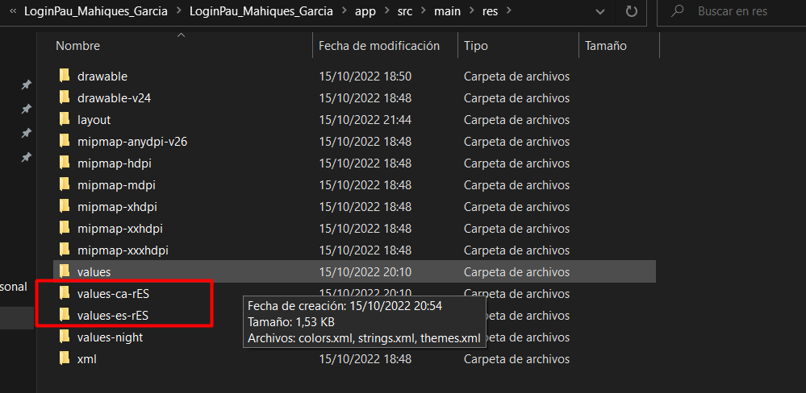
	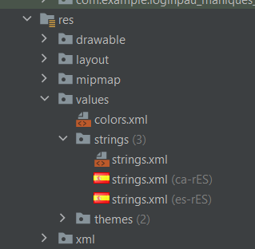
	
	

Fin - Pau Mahiques Garcia